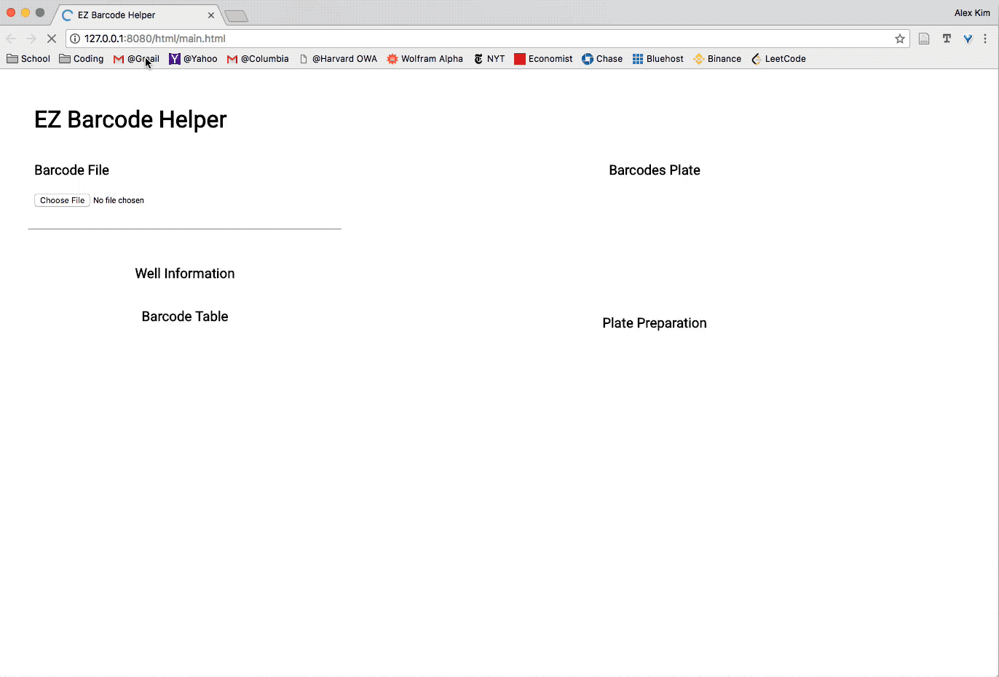
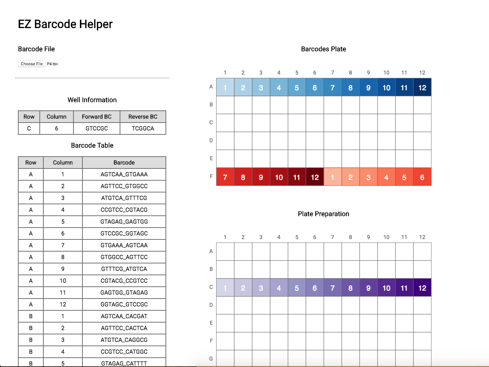
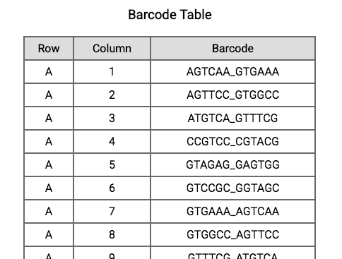
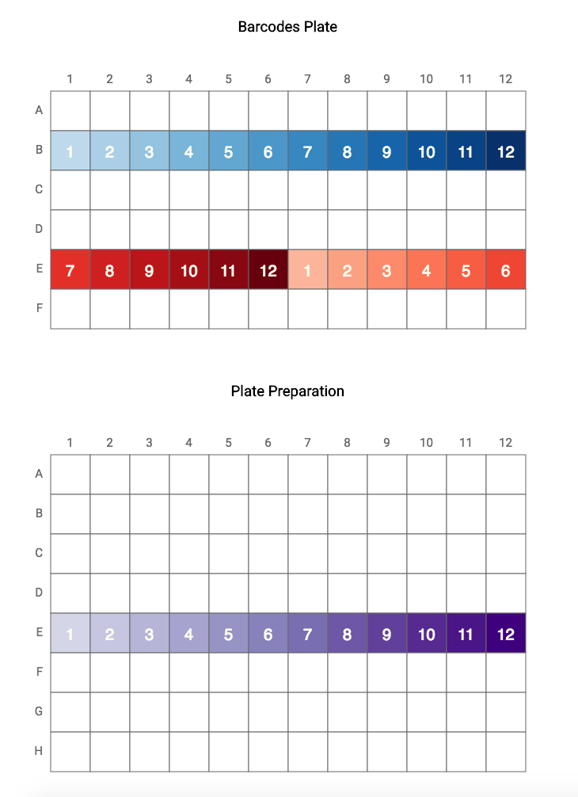

# EZ Barcode Helper

Make plate preparation for ScreenSeq more intuitive.

<p align="center">
  
</p>

## Background

This tool was created as a visual aid for preparing barcode plates for ScreenSeq. Creating barcode plates from master barcode maps can be tedious and error prone, because each map adheres to a different _rule_ (e.g., offset second row by one and combine with first row). This tool takes out the mental exercise of figuring out which barcode rows must be combined into which plate row.

## Get Started

Getting the app up and running is simple. If you don't have `Node.JS`, install it [here](https://www.npmjs.com/get-npm).

Run the following commands to install the npm dependencies and serve the local files on a server.

```{bash}
git clone https://github.com/alexkim205/EZ-Barcode-Helper.git
cd EZ-Barcode-Helper
npm install
npm run server
```

Go to [http://127.0.0.1:8080/html/main.html](http://127.0.0.1:8080/html/main.html) on a web browser of your choice.

Choose your barcode map file. This must be a tsv file in the below format. Example barcode maps can be found in the [data/barcodes/](https://github.com/alexkim205/EZ-Barcode-Helper/tree/master/data/barcodes) folder. 
<center>
| Row   | Column | Barcode       |
| :---: | :----: | ------------: |
| A     | 1      | AGTCAA_GTGAAA |
| A     | 2      | AGTCAA_GTGAAA |
| A     | 3      | ATGTCA_GTTTCG |
</center>


Once your barcode map is uploaded, a table of your tsv file will be displayed and you should be ready to play. Hover over the Plate Preparation plate to explore the interactive features of the app. 

<p align="center">
  
</p>

## Features

<p align="center">
  
</p>

1. Per Well Information is displayed on the left sidebar as you hover over each well in the plate. 

<p align="center">
  
</p>

2. Display barcode table

<p align="center">
  
</p>


3. Highlighting a row in the plate to prep will highlight the two corresponding rows to pipette from in the barcode master plate.
4. The offset of the second barcode row (highlighted in red) is automatically detected from the barcode map file. Each highlighted well is numbered and shaded accordingly so that you can easily determine which wells must line up with each other. 
